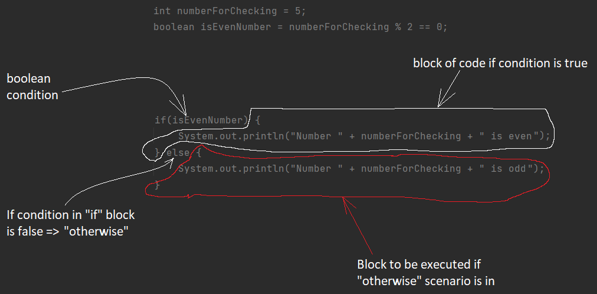
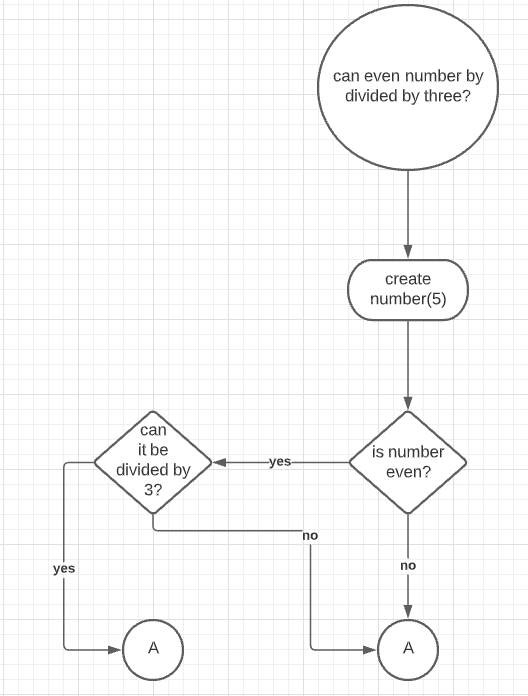

# - Introduction

Every day we make certain actions that we don't even notice: after waking up we brush our teeth, some of us do
exercises, than we go to work/studies etc.

These are linear activities, as they come one after another with no other options
(for simplicity we consider that we cannot skip any of actions above). In this block-scheme we can see that there's no
choice and the activities just are a "flow".

# The reasons why "if" statements are necessary in java

But those scenarios are not met so often in our lives as we can act differently and MAKE different decisions where there
are more than one probable outcomes, depending on some criteria or a condition, for example: when an enrollee decides
what college/university to enter, he has multiple options to choose from(for simplicity we will choose between 2), and
also the decision he is about to make is gonna have impact on his nearest future, e.g. entering technical University in
the majority of the cases means that studies and, probably, career is gonna be related to dealing with engineering
issues. On the other hand if the same student enrolls with college of laws, his future will be related to layer
activities and so on.

Here we can see that there's a certain variability(we have to think what abilities do we have), if we have technical
abilities than we probably will think of entering technical university, and it demonstrates that all activities after
the decision was made don't cross with the ones from the other flow(or block of actions), and eventually we get to
certain point which might be completely different from the one with the "law flow". And this demonstrates that one small
choice can lead to a completely different result.

# The key word "if" and "if" block structure

For such particular cases in all c-like languages there's an "if" construction which provides a developer with an
ability to change the program flow depending on certain circumstances(pseudocode example):

    if 5>4 =>then=> instruction 
    else =>then=> the other instruction

Here we can see the following parts:

1) if - keyword, which helps execute different codeblocks depending on condition check outcome. This keyword must always
   be the first in such blocks ("if").
2) condition to be checked - in the round brackets (5>4).
3) instruction to be executed if the condition is true, e.g. if 5>4 THEN do.... (=>then=> instruction).
4) else - keyword, which provides you with an opportunity what to do if condition in "if"
   block is false(else).
5) instruction to be executed if "else" case is in, e.g. if 5>4 then do.... OTHERWISE DO....(=>then=> the other
   instruction).

### A bit more about booleans

In the example above we saw something called as "condition", and in our case it was 5>4, this condition usually is used
to check the result of some expression, whether it's true or not. And there's a special primitive variable type in java
for such cases, which is called **boolean**. This type may contain only 2 values: **true** or **false**. To create such
variable you need to declare its type as boolean:

    boolean isEven = true;

Another important thing here is that it also can(and it usually does) contain the result of some operations:

    int five = 5;
    boolean isEven = five % 2 == 0;

in this case we expect our boolean isEven to contain the result of expression(five % 2 == 0) and the actual result
depends on "five": if the variable can be divided by 2 without a remainder then isEven is true. For our case the result
of expression is false as 5 cannot be divided by 2 without a remainder. The **boolean** type must contain the result of
any conditional(!, ||, &&) or comparative(==, !=) operator, as after the calculation of them, we get either true or
false.

## How about java?

Java provides you with the "if-else" blocks, with the following structure:

    int numberForChecking = 5;
    boolean isEvenNumber = numberForChecking % 2 == 0;
    if(isEvenNumber) {
        System.out.println("Number " + numberForChecking + " is even");
    } else {
        System.out.println("Number " + numberForChecking + " is odd");
    }

This is called conditional operator, and it consists of several parts:

1) if - keyword.
2) boolean condition - isEvenNumber.
3) block of code to be executed if the condition is true.
4) else - keyword, which provides you with an opportunity what to do if condition in "if"
   block is false.
5) block of code to be executed if "else" case is in.

### Time to "uncover" the magic

If the condition in brackets equals to true (number is even) than console output will be:
"Number 2 is even", but in our scenario numberForChecking is 5, which is odd, this is why condition in if brackets will
be false, and block of "otherwise" scenario is executed. And one more important think to mention is that if ANY
condition is true, other conditions below will not be checked and the code blocks of such conditions will not be
executed. And that means that code in different parts is separate one from another, and it never crosses.

## Multiple conditions within one if block

In reality, we can face cases when a simple checking is not enough, if we need to find number which are at the same time
are even and can be divided by 3(like 6), the simplest way it's gonna look like this:

    int number = 6;

    if(number % 2 == 0) {
        if(number % 3 == 0) {
            System.out.println("Number " + number + " is even and can be divided by 3!");     
        }
    }

All we say here is the if a number is even AND can be divided by 3 than... But instead of inserting 
one block inside another we can just use &&(and) operator:

    expressionOne && expressionTwo

This operator is true only when expressions on both sides are true:

    int number = 6;

    if(number % 2 == 0 && number % 3 == 0) {
        System.out.println("Number " + number + " is even and can be divided by 3!");     
    }

Also, we can check if something is OR smth:

    expressionOne || expressionTwo

This operator is true when at least 1 expression is true:

     int number = 9;

    if(number % 2 == 0 || number % 3 == 0) {
        System.out.println("Number " + number + " is even or can be divided by 3!");     
    }

Here number 9 is not even, but it can be divided by 3 this is why the whole expression is true.

Also, we can check if something is NOT smth:

      !expression

This operator is true when expression is false:

     int number = 9;

    if(!(number % 2 == 0)) {
        System.out.println("Number " + number + " is not even!");     
    }

The result of that expression is true as 9 cannot be divided by 2 without a reminder => which 
makes this expression false, but as we are using !(not) operator false becomes true(not false => true).

speak about speeding up boolean calculations

